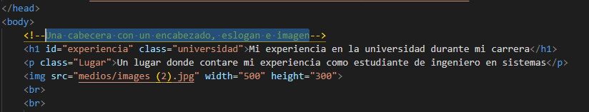

## Explicación de la creación de Maquetación HTML y css.

Para la creación de este documento de maquetación HTML la construí de la siguiente manera
Primero está la construcción del documento html:5 a como se puede observar en la imagen. Estaré mostrando las etiquetas y los colores que le di en css por cada enunciado de la practica.


Esta imagen muestra el acceso a css y el otro link es la fuente de letra que la practica exige descargar de google Font y el otro link lo pegue en css para que todo el documento tenga esa fuente.


Entonces en css esto se verá así donde agregue un color a dota la página y la fuente que descargue de Google Font.


## Una cabecera con un encabezado, eslogan e imagen.
En esta parte utilice las siguientes etiquetas que se muestran en la imagen un ```<h1></h1> ```para el encabezado y ```<p></p> ```para un párrafo y también agregue una imagen de encabezado del documento.

De esta manera construí el encabezado de mi documento y en css le agregue los siguiente

De esta manera construí el encabezado de mi documento y en css le agregué los siguiente centrando el encabezado, eslogan y la imagen.


```
```
## Un apartado de experiencia con un encabezado, su foto, encabezado y una tabla con su experiencia construida en su vida.


para la construcción de este encabezado utilice un ```<h1></h1> ``` para el encabezado de letras una imagen y un párrafo y una tabla solo con filas sin columnas.


todas estas etiquetas las estoy usando con clase en css, entonces en css le di las siguiente formas y colores a las filas


así estuve trabajando las etiquetas las estuve llamando desde css con clase declarándolas en html con clases.

## Un apartado de eventos con datos adicionales de compartir en eventos, presente una lista.
 para la creación del apartado de mi documento utilice un ```<h2></h2> ``` Para el encabezado de los eventos de la página después agregue una imagen y una ```<p></p> ``` para un párrafo a como se puede apreciar en la imagen y una lista de mis experiencias en una tabla.
  

 y posteriormente le di las siguiente formas y tamaño en css.
   

  ## Un apartado de recomendaciones sobre el aprendizaje de tecnologías, aquí incluya una lista de vínculos que correspondan con los apartados, cada vez que, de clic sobre uno de ellos, lo traslade al apartado seleccionado

  para la creación de este agregue un h2 unos párrafos y lista de los vínculos de los cuales estarán de forma dinámica enviándolo según la opción que selecciones para esto cree y nombres para así mismos llamarlo desde el vínculo a como se puede apreciar e la imagen.
  
  
  en css le di los siguientes formatos.
     
    para finalizar esta página de maquetación HTML y css le agregue un pie de página con la etiqueta <footer></footer>

   
   y le di el siguiente formato en css y color.
   
   


